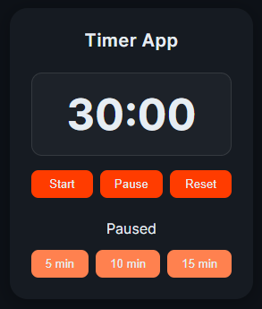

# ⏱ Timer App

A simple timer application built with **React, Vite, and TypeScript**.  
The timer function has been implemented. It currently supports preset durations of 5, 10, 15, and a default of 30 minutes. A custom time input feature will be added later, along with a Pomodoro-style timer mode.

---
📸 Screenshot


---

## 🚀 Features

- Display time in `MM:SS` format  
- Controls:  
  - **Start** – start the timer  
  - **Pause** – pause the countdown  
  - **Reset** – reset to default time (25:00 or 30:00)  
- Automatic stop at zero  
- Quick presets (5, 10, 15 minutes)  
- Styling with SCSS and variables  

---

## 🛠 Tech Stack

- [React](https://reactjs.org/)  
- [Vite](https://vitejs.dev/)  
- [TypeScript](https://www.typescriptlang.org/)  
- [SCSS](https://sass-lang.com/)  
---
## 📂 Project Structure

```bash
src/
 ├── components/        
 │   ├── Controls.tsx      # Timer controls (Start, Pause, Reset)
 │   ├── Settings.tsx      # Preset buttons (5, 10, 15 minutes)
 │   └── TimerDisplay.tsx  # Display current time
 ├── context/
 │   └── TimerContext.tsx  # Global timer state and logic
 ├── styles/
 │   ├── variables.scss    # SCSS variables
 │   └── global.scss       # Global styles
 ├── App.tsx
 └── main.tsx
